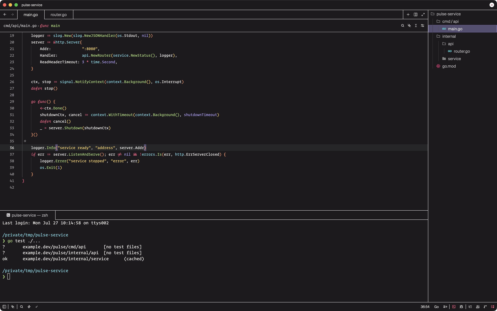
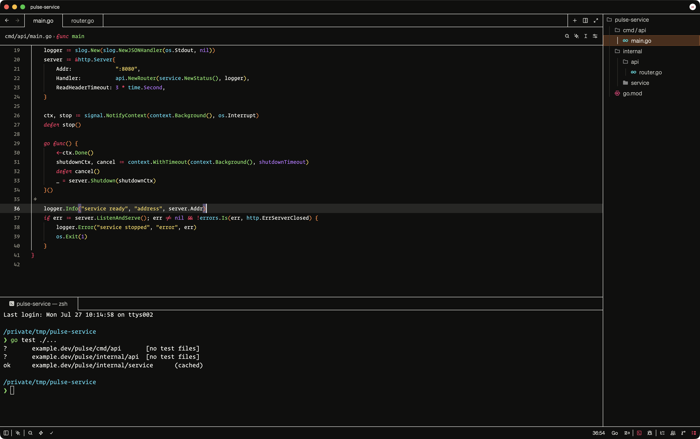
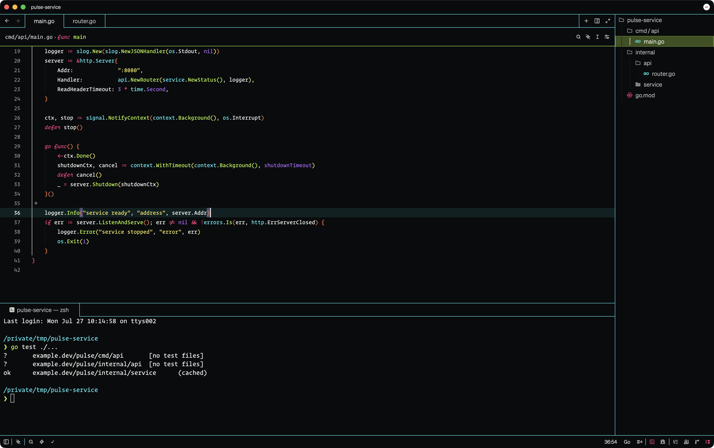

# Monobrut

A dark, high-contrast brutalist theme for [Zed](https://zed.dev/) with unified surfaces, crisp borders, and expressive signal colors.

**Default:** Warm, balanced signal colors on a deep black field.

**Breuer:** Hard brutalism: one concrete-black field, uncompromising white structure, rust active states, and exposed signal colors. Named for brutalist architect Marcel Breuer.

**Säure:** Cold cyberpunk structure with cyan borders, acid-green interaction states, and a near-black field.

## Installation

1. Open Zed Extensions with `ctrl-shift-x`.
2. Search for **Monobrut** and install it.
3. Open the theme selector with `cmd-k cmd-t` on macOS or `ctrl-k ctrl-t` on Linux and Windows.
4. Select **Monobrut**.

To try the development version, clone this repository and run `zed: install dev extension` from Zed's command palette, then select the cloned directory.

## Development

The theme lives in [`themes/monobrut.json`](themes/monobrut.json) and follows Zed's [theme schema](https://zed.dev/schema/themes/v0.2.0.json).
